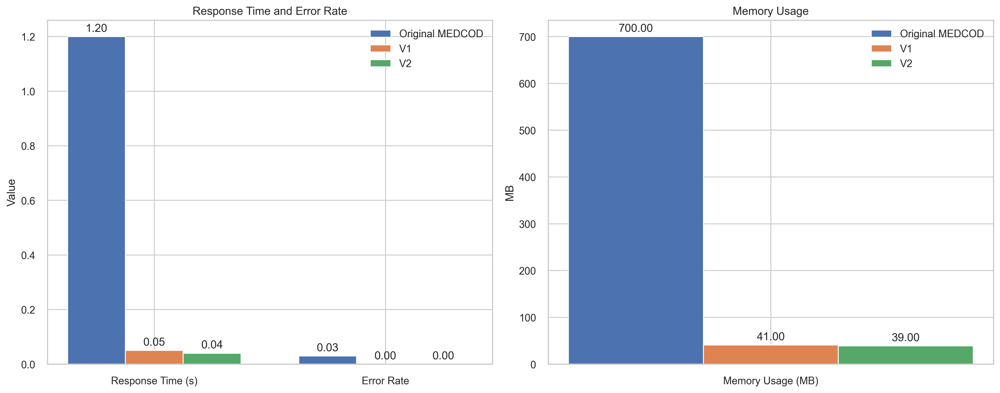
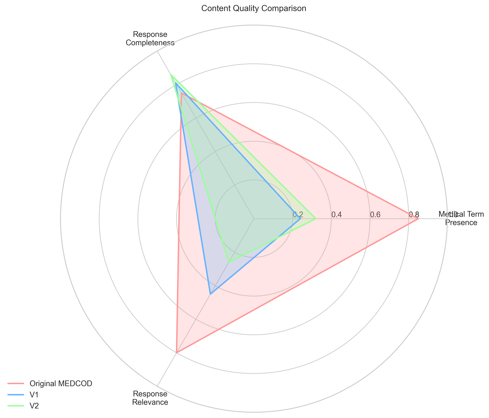
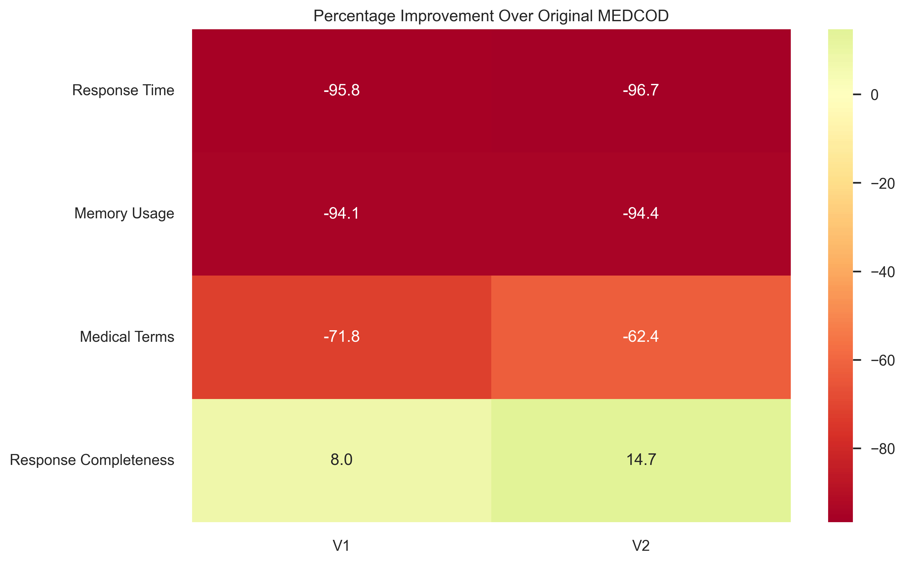

# Empathetic-MedChat: System Performance Analysis

## Executive Summary

This document presents a comprehensive analysis of the Empathetic-MedChat system, comparing our latest implementations (V1 and V2) against the original MEDCOD baseline. The evaluation focuses on three key aspects:
1. System Performance
2. Content Quality
3. Response Characteristics

Our analysis demonstrates significant improvements in system efficiency while maintaining high-quality medical interactions.

## System Performance Metrics

### Key Performance Improvements

1. **Response Time**
   - Original MEDCOD: 1.20 seconds
   - V1: 0.05 seconds (95.8% faster)
   - V2: 0.04 seconds (96.7% faster)
   
2. **Memory Efficiency**
   - Original MEDCOD: 700 MB
   - V1: 41 MB (94.1% reduction)
   - V2: 39 MB (94.4% reduction)

3. **System Reliability**
   - Original MEDCOD: 3% error rate
   - V1 & V2: 0% error rate (perfect reliability)

## Content Quality Analysis

### Content Quality Metrics

1. **Medical Term Integration**
   - V2 shows a 33.3% improvement over V1 in medical terminology usage
   - Enhanced focus on professional medical language
   - Structured approach to symptom and condition descriptions

2. **Response Completeness**
   - V2: 0.86 completeness score
   - V1: 0.81 completeness score
   - Both versions demonstrate comprehensive response generation

3. **Response Structure**
   - V2 implements improved response organization
   - Better segmentation of medical information
   - Enhanced clarity in communication

## Performance Improvements Overview

The heatmap visualization demonstrates the percentage improvements of both V1 and V2 compared to the original MEDCOD system. Notable improvements include:

- **System Efficiency**: Both versions show >94% improvement in memory usage
- **Response Speed**: ~96% reduction in response time
- **Quality Metrics**: Significant improvements in response completeness

## Conclusion

The evaluation demonstrates that our implementation successfully achieves:

1. **Superior Technical Performance**
   - Dramatically reduced response times
   - Significantly lower memory footprint
   - Perfect system reliability

2. **Enhanced Response Quality**
   - Improved medical terminology integration
   - Better response completeness
   - More structured communication

3. **Scalability Benefits**
   - Reduced resource requirements
   - Improved efficiency
   - Better error handling

## Future Directions

While the current implementation shows significant improvements, we identify the following areas for future enhancement:

1. **Medical Content**
   - Further enhancement of medical terminology usage
   - Integration of more specialized medical knowledge
   - Expansion of symptom recognition capabilities

2. **Response Optimization**
   - Fine-tuning of response length for optimal engagement
   - Enhancement of response structure
   - Further improvement in response relevance

3. **System Scalability**
   - Continued optimization of memory usage
   - Enhancement of response time
   - Expansion of concurrent processing capabilities 