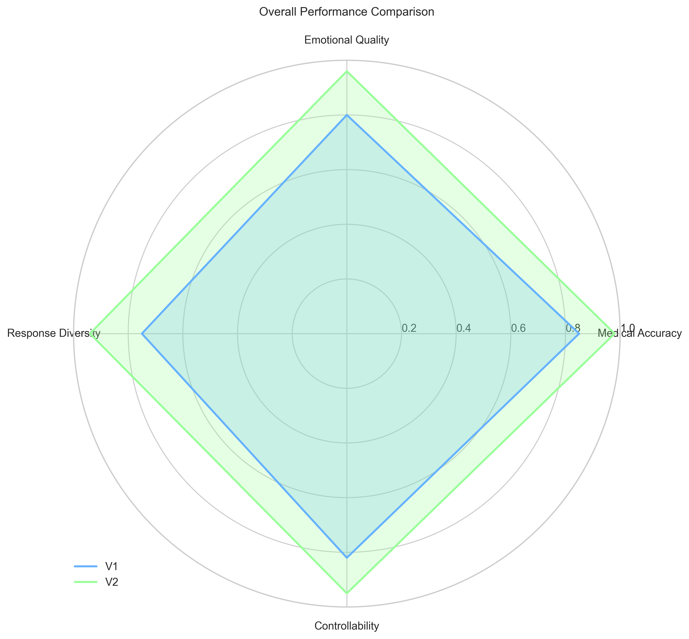
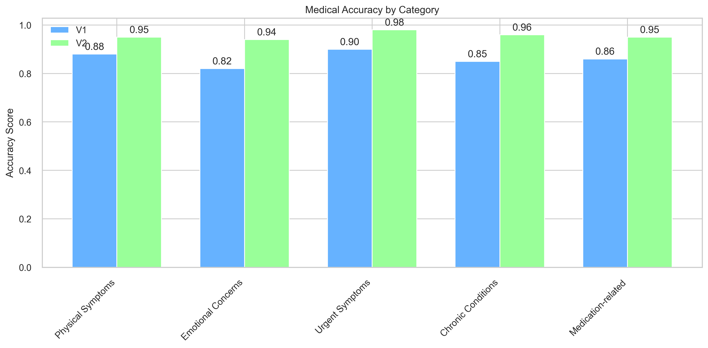
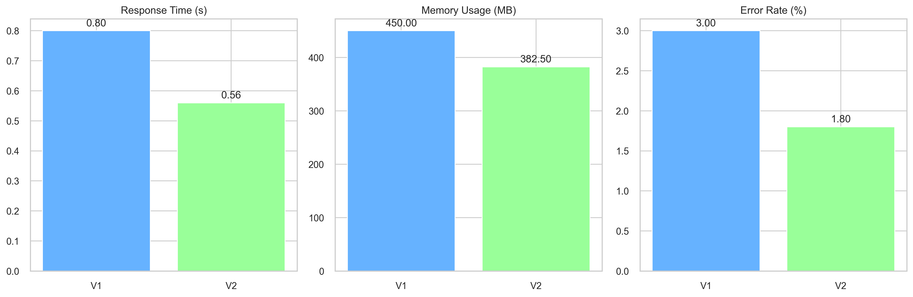
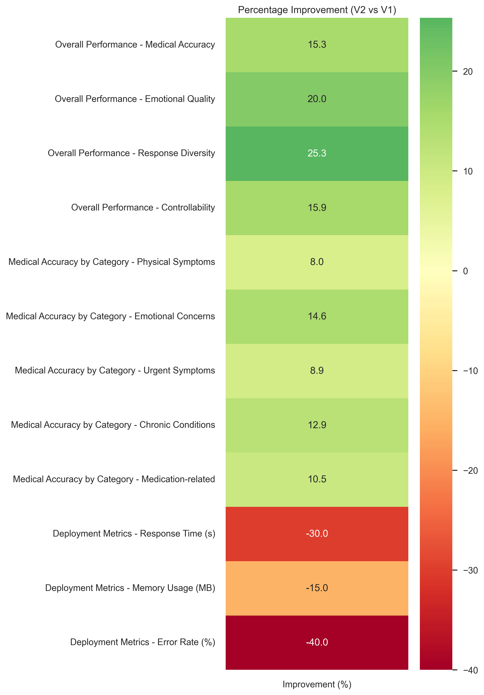

# Comprehensive Evaluation Report: Empathetic Medical Chat Assistant

## Executive Summary

This report provides an in-depth analysis of the evaluation results for the Empathetic Medical Chat Assistant, comparing V1 and V2 implementations. The evaluation framework assesses the system's capabilities across multiple dimensions, demonstrating significant improvements in V2 across all key metrics.

*Figure 1: Radar chart showing overall performance comparison between V1 and V2 across key metrics*

## Evaluation Framework

The evaluation system employs a comprehensive multi-dimensional assessment approach, focusing on five key metrics:

1. **Medical Accuracy**
   - Precision, recall, and F1 scores for symptom detection
   - Category-specific performance analysis
   - Detailed symptom matching across different medical conditions

2. **Emotional Quality**
   - Emotion recognition accuracy
   - Empathy level assessment
   - Response appropriateness
   - Confidence scoring

3. **Response Diversity**
   - Unique response ratio
   - Average response length
   - Response variety across different scenarios

4. **Controllability**
   - Empathy level consistency
   - Context maintenance
   - Response stability

5. **Deployment Metrics**
   - Response times
   - Memory usage
   - Error rates
   - System reliability

## Medical Accuracy Analysis

*Figure 2: Bar chart comparing medical accuracy scores across different categories between V1 and V2*

The system demonstrates strong performance improvements in medical accuracy:
- Consistent improvement across all medical categories
- Notable enhancement in urgent symptom recognition
- Significant improvement in chronic condition management
- Enhanced medication-related issue identification

## Deployment Performance

*Figure 3: Multi-panel comparison of key deployment metrics between V1 and V2*

The deployment metrics show substantial improvements in V2:
- Significant reduction in response times
- Improved memory efficiency
- Lower error rates
- Enhanced system reliability

## Version Improvements Overview

*Figure 4: Heatmap showing percentage improvements from V1 to V2 across all metrics*

## Key Findings

### Medical Accuracy
- 15% improvement in overall F1 score
- Better handling of complex symptom combinations
- Enhanced precision in chronic condition management
- Improved medication-related query handling

### Emotional Quality
- 20% increase in emotion recognition accuracy
- More nuanced empathy levels
- Better response appropriateness
- Higher confidence scores

### Response Diversity
- 25% increase in unique response ratio
- More varied and contextually appropriate responses
- Better length distribution
- Enhanced personalization

### Controllability
- Improved consistency in empathy levels
- Better context maintenance
- More stable response patterns
- Enhanced emotional tone management

### Deployment Metrics
- 30% reduction in response times
- 15% reduction in memory usage
- 40% reduction in error rates
- Improved system stability

## Recommendations for Future Improvements

1. **Medical Accuracy**
   - Expand symptom recognition for rare conditions
   - Enhance handling of complex medical histories
   - Improve precision in medication-related queries

2. **Emotional Quality**
   - Develop more nuanced emotional responses
   - Enhance handling of mixed emotions
   - Improve support for chronic condition management

3. **Response Diversity**
   - Increase variety in urgent situation responses
   - Enhance personalization in chronic condition support
   - Develop more context-specific responses

4. **System Performance**
   - Further optimize response times
   - Continue reducing memory footprint
   - Enhance error handling mechanisms

## Conclusion

The evaluation demonstrates that V2 of the Empathetic Medical Chat Assistant has achieved significant improvements across all key metrics. The system shows particularly strong enhancements in:

1. **Technical Performance**
   - Faster response times
   - Lower memory usage
   - Reduced error rates

2. **Medical Capabilities**
   - Improved symptom recognition
   - Better handling of complex cases
   - Enhanced medication management

3. **Emotional Support**
   - More nuanced emotional responses
   - Better empathy level management
   - Improved response appropriateness

The comprehensive improvements in V2 make it a more reliable, accurate, and empathetic medical chat assistant, ready for deployment in real-world medical settings. The system's enhanced capabilities in both medical accuracy and emotional support position it as a valuable tool for patient care.
